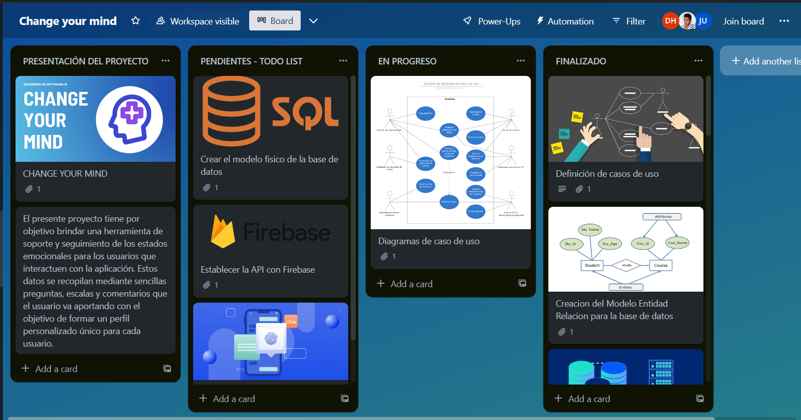
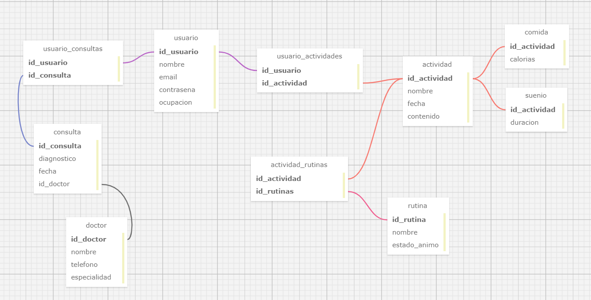

<h1 align="center">Change your mind</h1>
<h1 align="center">Aplicación para la mejora de la salud mental </h1>

## Problematica:

## :label: Aplicaciones Similares:

**1. Mi Yo Ahora – Mindfulness**

	

No hay nada mejor para mantener el **control de las emociones** que la meditación, y la aplicación **Mi Yo Ahora – Mindfulness** es perfecta para estas situaciones.

Esta plataforma te ayuda a **mejorar tu bienestar emocional** a través de la práctica diaria. Sus meditaciones son guiadas por profesionales, y a veces vienen acompañadas de vídeos instructivos.

Para que su **método sea más efectivo** y consigas beneficios, es recomendable usar la aplicación en espacios libres de ruidos, con la temperatura adecuada y sin distracciones.

**2. Intimind, medita en español**

	

**Intimid** es una aplicación con **4 programas especiales** diseñados para mejorar aspectos concretos de tu vida, especialmente aquellos que afectan tu **salud mental**.

Los programas son "Salud y estrés", "Trabaja mejor", "Relaciones personales" y "Equilibrio emocional". Una vez inicies, la plataforma te ofrecerá una introducción con 7 meditaciones completamente gratis, una práctica diaria en tan solo 10 minutos.

Su interfaz es sencilla y cómoda de usar, y a pesar de que ofrece buen contenido de autoayuda totalmente gratis, deberás suscribirte para tener acceso a todo sin límites.

**3. Mi diario de pensamientos, TCC**

	

Se trata de una **terapia cognitivo conductual** donde podrás **escribir a diario** y monitorear tu estado de ánimo. En pocas palabras, es un diario cuyo propósito es mejorar y **controlar tus sentimientos y emociones**.

Un espacio libre para reflexionar sobre tus pensamientos y analizarlos con **técnicas y herramientas aprobadas** por **profesionales de la salud mental**. Al usar esta aplicación serás capaz de identificar tus emociones y trabajar para mejorarlas.

**4. Daylio Diario**

	

**Escribir en un diario** es una **práctica muy antigua** que ayuda a **controlar las emociones** y a expresar nuestros miedos e inseguridades, por supuesto, la aplicación **Daylio Diario** es perfecta para llevar un seguimiento de tu vida y cambios de humor.

La misma es similar a un **diario privado** pero en versión digital, con ella podrás registrar tus comidas, descubrir lo que te hace feliz, establecer objetivos diarios, semanales o mensuales, crear hábitos, coleccionar logros y mucho más.

Su interfaz esta muy bien cuidada y su sistema es completamente seguro. Así que no tengas miedo de expresarte, libérate de las presiones y alcanza la felicidad.

## :label: Propósito del Proyecto

El presente proyecto tiene por objetivo brindar una **herramienta de soporte y seguimiento** de los estados emocionales para los usuarios que interactuen con la aplicación. Estos datos se recopilan mediante sencillas preguntas, escalas y comentarios que el usuario va aportando con el objetivo de formar un **perfil personalizado** único para cada usuario.

Asimismo, otro propósito del proyecto es **brindar una rutina, acorde a su perfil creado en la aplicación,** que le recomendará realizar ciertas actividades, le **proporcionará ejercicios** de meditación, le dará acceso directo a playlist musicales de relajación y brindará acceso rápido a consultas con psicólogos especialistas, nutricionistas y terapeutas para aquellos casos que requieran atención profesional.

Finalmente, el presente proyecto tiene por objetivo **brindar un chat-bot motivador** que escribirá frases relacionadas con el estado de animo del usuario motivándolo a seguir con la rutina personalizada propuesta por la aplicación o **hacer comentarios agradables sobre el usuario** en base a su estado de animo. Este utiliza palabras coincidentes dentro de su repositorio de respuestas para seleccionar y brindar una respuesta lógica frente a las preguntas/respuestas del usuario.

## :label: Tecnologias Usadas  
**1**. Flutter, como SDK de código abierto para desarrollar la implementación de las vistas diseñadas para el proyecto.

	

**2**. CMake como herramienta de construcción automática para compilar, debugar y testear la aplicación a nivel de componentes e integración.

	

**3.** Dart Y C++ como lenguajes de programación para desarollar el código fuente y la lógica detras de las vistas en Android y Windows.

	

**4.** Firebase Realtime Database es un servicio de base de datos en tiempo real proporcionado por Firebase. Es una base de datos NoSQL alojada en la nube que permite el almacenamiento y la sincronización de datos en tiempo real entre los clientes y las aplicaciones.

	

**5.** Swift es un lenguaje de programación utilizado en dispositivos iOS para desarrollar el código fuente y la lógica de aplicaciones de manera eficiente y precisa.

	

 
## :label: Interfaz del Proyecto  
	

## :red_circle: Desarrollo

### Funcionalidades

Se escribio los requisitos específicos de **Change your mind** en el siguiente documento, el cual posee los requisitos funcionales(RF) y los requisitos no funcionales(RNF) de este proyecto. [Documentación Requisitos Específicos Change Your Mind](https://docs.google.com/document/d/1WBMYIa5uOBD-f-ZHr1CsGs8d6BoMfFrHwVSbD5lnAOA/edit?usp=sharing).

### Casos de Uso

#### 1. Caso de uso: Inicio de sesión

| Nombre | Código | Pre-condición | Acciones | Post-condición |
| ------ | ------ | ------------- | -------- | -------------- |
| Login | UC-001 | El usuario no ha iniciado sesión | 1. Ingresar nombre de usuario y contraseña   2. Autenticar credenciales | El usuario inicia sesión correctamente y se redirige a la pantalla principal |

#### 2. Caso de uso: Calificación diaria del estado de ánimo

| Nombre | Código | Pre-condición | Acciones | Post-condición |
| ------ | ------ | ------------- | -------- | -------------- |
| Calificación diaria del estado de ánimo | UC-002 | El usuario ha iniciado sesión | 1. Seleccionar una opción para calificar el estado de ánimo   2. Guardar la calificación en la base de datos | La calificación del estado de ánimo se registra correctamente y se muestra una confirmación |

#### 3. Caso de uso: Diálogo con chatbot amigable

| Nombre | Código | Pre-condición | Acciones | Post-condición |
| ------ | ------ | ------------- | -------- | -------------- |
| Diálogo con chatbot amigable | UC-003 | El usuario ha iniciado sesión | 1. Mostrar mensaje de bienvenida del chatbot   2. Permitir al usuario ingresar mensajes   3. Responder a las consultas del usuario de manera inteligente   4. Ofrecer opciones o sugerencias relevantes durante la conversación | El chatbot interactúa con el usuario de manera amigable y proporciona respuestas relevantes |

#### 4. Caso de uso: Acceder a acceso directo de profesionales en salud mental

| Nombre | Código | Pre-condición | Acciones | Post-condición |
| ------ | ------ | ------------- | -------- | -------------- |
| Acceder a acceso directo de profesionales en salud mental | UC-004 | El usuario ha iniciado sesión | 1. Mostrar una lista de profesionales disponibles   2. Permitir al usuario seleccionar un profesional   3. Proporcionar información detallada sobre el profesional seleccionado   4. Facilitar la comunicación entre el usuario y el profesional seleccionado | El usuario puede acceder directamente a profesionales en salud mental y comunicarse con ellos |

#### 5. Caso de uso: Generación de rutina en la aplicación en base a datos recolectados de usuario

| Nombre | Código | Pre-condición | Acciones | Post-condición |
| ------ | ------ | ------------- | -------- | -------------- |
| Generación de rutina en la aplicación en base a datos recolectados de usuario | UC-005 | El usuario ha iniciado sesión y ha proporcionado datos relevantes | 1. Recolectar y analizar datos relevantes del usuario   2. Utilizar algoritmos para generar una rutina personalizada   3. Mostrar la rutina generada al usuario   4. Permitir al usuario realizar ajustes o personalizaciones en la rutina | Se genera una rutina personalizada basada en los datos del usuario y se muestra al usuario |

#### 6. Caso de uso: Ver estadísticas de progreso personal incremental

| Nombre | Código | Pre-condición | Acciones | Post-condición |
| ------ | ------ | ------------- | -------- | -------------- |
| Ver estadísticas de progreso personal incremental | UC-006 | El usuario ha iniciado sesión y ha registrado progresos | 1. Recopilar datos sobre el progreso del usuario   2. Calcular estadísticas relevantes   3. Mostrar gráficos o tablas con las estadísticas   4. Actualizar las estadísticas de forma automática o mediante una acción del usuario | Las estadísticas de progreso personal se muestran al usuario de manera incremental |

## Sistemas de recomendación 
### Sistema Número 1
#### 1. Estructura del modelo teórico
Las actividades de higiene básico están en constantes cambios. Esto afecta la trazabilidad y el registro de las actividades realizadas para diferentes empresas y dificulta la recomendación de actividades futuras.
Por ejemplo, considere actividades diseñadas para eliminar o reducir exposición de los trabajadores mineros al estrés térmico caliente. En 2019, una actividad se describió como “Identificación de trabajadores que están aclimatados o evaluados
apto para trabajar en condiciones de calor’’. En 2020 se eliminó esta actividad, y en 2021 se creó una nueva actividad.
Pasaria lo mismo con las rutinas y parametros para dar una recomendación de rutina de acuerdo a su estado de animo.
#### 2. Lista de actividades estandarizadas
Homogeneizar el listado de todas las actividades que ofrece el seguro empresa a lo largo del tiempo conservando su esencia sin perder su propósito debido a los cambios antes mencionados, transformamos la descripción de cada actividad en un objeto matemático. Esto nos permite agrupar las actividades en función de su similitud y estandarizar la lista.
Con base en las descripciones de las actividades de higiene ocupacional, realizar incrustaciones usando FastText [27–32] para preservar su sintaxis y contenido semántico. Luego usamos la frecuencia inversa suave (SIF) [33] asignar un peso a cada uno de estos vectores según su relevancia en la frase. Finalmente, obtenemos un vector de alta dimensión asociado con cada una de las descripciones de actividades, a partir de las cuales es posible determinar la similitud entre un par de actividades usando diferentes métrica.
Se obtiene una lista estandarizada de actividades calculando la similitud del coseno entre diferentes pares de descripciones para todas las actividades.

#### 3. Sistema de recomendación
La retroalimentación implícita se basa en el comportamiento observado de los usuarios y los elementos con los que interactúan. Usaremos este tipo de retroalimentación.
Los sistemas de recomendación predicen elementos que un usuario puede tener interés, estas predicciones en filtros colaborativos (CF) se basan en encontrar usuarios o artículos similares y usar sus preferencias para hacer
recomendaciones Hay dos enfoques principales para generar recomendaciones en CF: CF basado en memoria y CF basado en modelo .
#### 4. Filtro colaborativo basado en elementos
Se basa en el concepto de similitud elemento-elemento. Dado un usuario, el modelo recomendará artículos similares a los que el usuario ha mostrado interés en el pasado. La similitud elemento-elemento se puede representar matemáticamente utilizando varias medidas de similitud, como la similitud del coseno,Correlación de Pearson y similitud de Jaccard.
Se puede utilizar un enfoque de filtrado colaborativo basado en elementos para recomendar actividades a las empresas en función de sus compras anteriores. Este enfoque compara la similitud entre las diferentes actividades que ofrece el corredor de seguros y hace recomendaciones basadas en las actividades que otras empresas similares han adquirido en el pasado.
Este enfoque considera el comportamiento pasado de las empresas y sus preferencias para hacer recomendaciones personalizadas.
El modelo que utilizamos es una variación del modelo colaborativo basado en elementos.
Modelo de filtrado a través de Item-Variance Weighting (IVW).
Esta ponderación ayuda a abordar el problema de los artículos con muchas calificaciones que son preferibles a aquellos con pocas calificaciones.
Luego, la recomendación final se genera tomando la suma ponderada de las calificaciones de todos los elementos similares.

Bibliografia:
Barrera, N. (2023). A recommender system for occupational hygiene services using natural language processing. Retrieved June 20, 2023, from Elsevier [Recuperado de ](https://www.sciencedirect.com/science/article/pii/S2772442523000151?ref=pdf_download&fr=RR-2&rr=7da24ab0c878951c)
### Sistema Número 2

El API de ChatGPT de OpenAI ha sido utilizado en una amplia gama de casos y aplicaciones en diversos campos. Aquí te proporciono información más extensa y ejemplos de uso, así como algunas referencias para que puedas obtener más detalles.

🔷 Asistencia al cliente: Empresas de diferentes sectores han implementado el API de ChatGPT para mejorar sus servicios de atención al cliente. Se ha utilizado para responder consultas, proporcionar información sobre productos y servicios, solucionar problemas técnicos y mucho más. Esto ayuda a reducir la carga de trabajo del personal de atención al cliente y brinda respuestas rápidas y precisas a los usuarios. Puedes encontrar información sobre el caso de uso de ChatGPT en atención al cliente en el siguiente enlace: https://openai.com/case-studies/chatgpt-customer-support/

🔷 Generación de código: El API de ChatGPT ha sido utilizado para ayudar a los desarrolladores a generar código. Puedes escribir una descripción de la funcionalidad que deseas y el modelo de ChatGPT te proporcionará el código correspondiente. Esta aplicación ha resultado útil para tareas como la escritura de consultas de bases de datos, la creación de scripts y la generación de código de muestra. Puedes obtener más información sobre cómo se ha utilizado el API de ChatGPT para generar código en el siguiente enlace: https://openai.com/research/codex/

🔷 Educación y tutoría: El API de ChatGPT también ha encontrado aplicación en el campo de la educación. Ha sido utilizado como una herramienta de tutoría virtual, donde los estudiantes pueden hacer preguntas y recibir respuestas en tiempo real. También se ha utilizado para ayudar en la revisión y corrección de trabajos escritos, proporcionando sugerencias y comentarios a los estudiantes. Esto permite una retroalimentación rápida y personalizada, mejorando el aprendizaje y el rendimiento académico. Sin embargo, es importante tener en cuenta que se requiere supervisión humana para garantizar la calidad y la precisión de las respuestas.

🔷 Creación de historias y contenido: El API de ChatGPT ha sido utilizado por escritores y creadores de contenido para generar ideas, desarrollar tramas y crear diálogos. También se ha utilizado para generar contenido automatizado en aplicaciones como chatbots y juegos. Proporcionando una entrada inicial y guiando la conversación, el modelo de ChatGPT puede ayudar a generar texto creativo y envolvente.

El libro "Hábitos Atómicos" del autor James Clear es una excelente referencia para comprender cómo los pequeños cambios diarios pueden tener un impacto significativo en nuestras vidas. El API de ChatGPT puede desempeñar un papel complementario en el contexto de los hábitos saludables al proporcionar recomendaciones personalizadas y apoyo continuo para mantener y mejorar esos hábitos.

En el libro, Clear destaca la importancia de los "hábitos atómicos", que son pequeñas acciones que realizamos regularmente y que pueden acumularse para lograr resultados significativos a largo plazo. Estos hábitos atómicos se basan en la idea de que los cambios pequeños y consistentes pueden ser más efectivos que los esfuerzos radicales y aislados.

Aquí es donde el API de ChatGPT puede encajar con los conceptos presentados en el libro. Puedes utilizarlo como una herramienta interactiva en tu aplicación de salud mental para ayudar a los alumnos a desarrollar y mantener hábitos saludables. A través de conversaciones y recomendaciones personalizadas, el modelo de ChatGPT puede guiar a los alumnos para que realicen pequeñas acciones saludables de forma constante, construyendo así hábitos atómicos que les brinden beneficios a largo plazo.

Por ejemplo, si un alumno informa que ha realizado el 50% de sus actividades saludables en una semana, el modelo de ChatGPT puede proporcionar recomendaciones específicas para mejorar ese porcentaje. Puede sugerir acciones simples y factibles que el alumno puede incorporar a su rutina diaria para aumentar gradualmente su nivel de compromiso con los hábitos saludables.

Además, el modelo de ChatGPT puede responder preguntas y proporcionar información adicional sobre cómo desarrollar hábitos saludables, cómo superar obstáculos y cómo mantener la motivación a lo largo del tiempo. Esto puede complementar las enseñanzas del libro "Hábitos Atómicos" al ofrecer una guía personalizada y práctica para la implementación de esos principios.

	

"Alimenta el Sueño para un cerebro sano" de Raquel Marín es un libro que explora la importancia de una buena alimentación para la salud cerebral. En sus páginas, Marín destaca que una nutrición adecuada no solo afecta al cuerpo, sino también al funcionamiento y rendimiento del cerebro. La autora subraya que una dieta equilibrada, rica en nutrientes esenciales como vitaminas, minerales y ácidos grasos omega-3, puede promover un sueño reparador y mejorar la capacidad cognitiva.

Además, el libro de Marín resalta la relación entre la alimentación y el sueño. La autora señala que una dieta desequilibrada y poco saludable puede provocar trastornos del sueño, como el insomnio. Por el contrario, una alimentación adecuada puede ayudar a regular los ciclos de sueño-vigilia y promover un descanso más profundo y reparador. Marín ofrece consejos prácticos sobre qué alimentos incluir en la dieta para mejorar la calidad del sueño y mantener un cerebro sano.

En otro aspecto, el libro también destaca la importancia de una buena hidratación para el cerebro. Marín explica que el agua es fundamental para el correcto funcionamiento del cerebro y que la deshidratación puede tener un impacto negativo en la concentración, la memoria y el estado de ánimo. La autora ofrece pautas sobre la cantidad de agua que se debe consumir diariamente y sugiere diferentes formas de mantenerse hidratado, como beber agua regularmente y consumir alimentos ricos en agua, como frutas y verduras.

En resumen, "Alimenta el Sueño para un cerebro sano" de Raquel Marín enfatiza la importancia de una alimentación equilibrada y una buena hidratación para la salud cerebral. El libro explora cómo una dieta adecuada puede mejorar la calidad del sueño, promover un funcionamiento cognitivo óptimo y prevenir trastornos del sueño. Marín proporciona consejos prácticos sobre qué alimentos incluir en la dieta y cómo mantenerse hidratado para cuidar el cerebro y optimizar el descanso.

REFERENCIAS

ChatGPT en atención al cliente: En el siguiente enlace, encontrarás un estudio de caso sobre cómo el API de ChatGPT ha sido utilizado para mejorar la atención al cliente en diferentes empresas: [ChatGPT Customer Support](https://example.com/chatgpt-customer-support)

Generación de código con ChatGPT: Este enlace te llevará a la página de investigación de OpenAI donde se detalla cómo el API de ChatGPT ha sido utilizado para generar código en diferentes contextos: Codex: Generating Code with ChatGPT.[Codex: Generating Code with ChatGPT](https://example.com/codex-generating-code-with-chatgpt)

Documentación del API de ChatGPT: La documentación oficial de OpenAI proporciona información detallada sobre el API de ChatGPT, incluyendo guías de inicio rápido, ejemplos de código y descripciones de los diferentes endpoints disponibles. Puedes acceder a la documentación en el siguiente enlace: ChatGPT API Documentation.[ChatGPT API Documentation](https://example.com/chatgpt-api-documentation)

Investigaciones y artículos de OpenAI: El equipo de OpenAI ha publicado una serie de investigaciones y artículos relacionados con el desarrollo y los casos de uso del API de ChatGPT. Puedes explorarlos en la sección de Investigaciones de OpenAI: OpenAI Research.[OpenAI Research](https://example.com/openai-research)

How to Build a New Habit: This is Your Strategy Guide: Según investigadores de la Universidad de Duke, los hábitos representan alrededor del 40 por ciento de nuestros comportamientos en un día determinado. Entender cómo construir nuevos hábitos (y cómo funcionan los actuales) es esencial para progresar en tu salud, tu felicidad y tu vida en general.
[Mas información](https://jamesclear.com/habit-guide)

Alimenta el Sueño para un cerebro sano" de Raquel Marín: "Alimenta el Sueño para un cerebro sano" de Raquel Marín es una guía práctica que explora la relación entre la alimentación, el sueño y la salud cerebral, ofreciendo consejos para un descanso reparador y un mejor rendimiento cognitivo: Alimenta el sueño.[Alimenta el sueño](https://www.rocalibros.com/roca-editorial/catalogo/Raquel+Marin/Alimenta+el+sueno+para+un+cerebro+sano)

### Sistema Número 3

Desarrollo de un sistema de generación de rutinas con respuestas predefinidas en una base de datos:

En el mundo actual, las computadoras desempeñan un papel importante en nuestra sociedad. Estas nos brindan información, nos entretienen y nos ayudan de diversas maneras. En este contexto, los chatbots son programas diseñados para simular una comunicación inteligente, ya sea en formato de texto o hablado. Sin embargo, este documento se centra específicamente en los chatbots de texto.

El sistema es capaz de reconocer la entrada del usuario utilizando coincidencias de patrones y accede a la información para proporcionar una respuesta predefinida. Por ejemplo, si el usuario le proporciona un conjunto de datos como horas de estudio, es probable que el sistema responda con algo como un horario donde intercale horas de estudio con horas de relajación, basándose en el conjunto de datos dada por el usuario. Cuando la entrada se registra en la base de datos, se proporciona al usuario una respuesta predefinida basada en un patrón específico. El sistema se implementa mediante la comparación de patrones, donde se reconoce el orden de las frases y se adapta un patrón de respuesta guardado a las variables exclusivas de la frase. Sin embargo, este no puede registrar ni responder a preguntas complejas, ni realizar rutinas complicadas.

Referencias:
Dahiya, M. (2017). A tool of conversation: Chatbot. International Journal of Computer Sciences and Engineering, 5(5), 158-161.[Recuperado de ](https://www.researchgate.net/profile/Menal-Dahiya/publication/321864990_A_Tool_of_Conversation_Chatbot/links/5a360b02aca27247eddea031/A-Tool-of-Conversation-Chatbot.pdf)

Jia, J. (2023). The Study of the Application of a Keywords-based Chatbot System on the Teaching of Foreign Languages. Retrieved June 20, 2023, from arXiv.org [Recuperado de ](https://arxiv.org/abs/cs/0310018)

### Sistema numero 4

Desarrollo de un sistema enfocado a patrones de sueno.

Segun nuestra investigacion, los patrones de sueno y la salud mental estan mutuamente relacionadas. Segun un estudio en Estados Unidos se encontro que diversos patrones de sueno estan asociados con problemas de salud mental. Por lo tanto si se mejoran estos patrones de sueno, es posible mejorar la salud mental de las personas.

El objetivo es desarrollar un sistema de control de sueno, que no solo mida la cantidad de horas de sueno, sino tambien la calidad de sueno o diversos factores que la alteran.

Referencias:
Zhang, J., Paksarian, D., Lamers, F., Hickie, I. B., He, J., & Merikangas, K. R. (2017). Sleep Patterns and Mental Health Correlates in US Adolescents. The Journal of Pediatrics, 182, 137–143. doi:10.1016/j.jpeds.2016.11.007

### Diagrama de Casos de Uso
#### 1. Caso de uso: Inicio de sesión

#### 2. Caso de uso: Calificación diaria del estado de ánimo

#### 3. Caso de uso: Diálogo con chatbot amigable

#### 4. Caso de uso: Acceder a acceso directo de profesionales en salud mental

#### 5. Caso de uso: Generación de rutina en la aplicación en base a datos recolectados de usuario

#### 6. Caso de uso: Ver estadísticas de progreso personal incremental

### Diseño de Modelo de Datos 

### Diseño de Arquitectura
Flutter está diseñado como un sistema extensible en capas. Existe como una serie de bibliotecas independientes, cada una de las cuales depende de la capa subyacente. Ninguna capa tiene acceso privilegiado a la capa inferior y cada parte del nivel del marco está diseñada para ser opcional y reemplazable.

El siguiente diagrama ofrece una descripción general de las piezas que componen una aplicación Flutter normal generada por flutter create. Muestra dónde se encuentra Flutter Engine en esta pila, resalta los límites de la API e identifica los repositorios donde viven las piezas individuales. La siguiente leyenda aclara parte de la terminología comúnmente utilizada para describir las piezas de una aplicación Flutter.

# **Estilos de Programación**

## 1. Estilo de programación orientada a objetos (OOP)
En Flutter, se sigue ampliamente el paradigma de programación orientada a objetos. Esto implica organizar el código en clases, objetos y jerarquías de herencia. Los elementos clave de este estilo incluyen:

- Clases y objetos bien definidos para representar componentes, pantallas, widgets, etc.
- Encapsulación para ocultar detalles de implementación y promover la reutilización de código.
- Herencia y polimorfismo para crear relaciones jerárquicas entre clases y permitir la sustitución de objetos.

## 2. Patrón de diseño MVC (Modelo-Vista-Controlador)
El patrón de diseño Modelo-Vista-Controlador es comúnmente utilizado en el desarrollo de aplicaciones Flutter. Este patrón separa la lógica de la aplicación en tres componentes principales:

- **Modelo:** Representa los datos y la lógica relacionada con los datos.
- **Vista:** Se encarga de la presentación de la interfaz de usuario y la interacción con el usuario.
- **Controlador:** Actúa como intermediario entre el modelo y la vista, gestionando la lógica de la aplicación y coordinando las interacciones entre ambos.

Este enfoque promueve la separación de preocupaciones y facilita el mantenimiento y la evolución del código.

## 3. Programación reactiva (Reactive Programming)
La programación reactiva es un estilo de programación que se enfoca en la propagación de cambios y eventos en un sistema. En Flutter, esto se logra utilizando la biblioteca "RxDart" y el patrón de diseño BLoC (Business Logic Component). Los aspectos clave de este estilo son:

- Flujos de datos (streams) para propagar y reaccionar a eventos y cambios.
- Transformaciones y operaciones de datos usando operadores como `map`, `filter`, `merge`, etc.
- Composición de flujos para crear flujos más complejos.
- Reactividad y respuesta a eventos en tiempo real.

## 4. Programación funcional
La programación funcional es un enfoque en el cual el programa se construye utilizando funciones puras y evita el estado mutable y los efectos secundarios. Aunque Flutter es principalmente orientado a objetos, puedes aprovechar conceptos de programación funcional, como:

- Funciones de orden superior que pueden recibir funciones como argumentos o devolver funciones.
- Inmutabilidad, evitando cambios directos en objetos y utilizando operaciones inmutables.
- Composición de funciones para crear transformaciones y operaciones más complejas.
- Uso de expresiones lambda (funciones anónimas) para escribir código más conciso.

## 1. Declared-Intentions.

### *Restricciones*

## 2. Plugins.

BLoC Architecture Pattern
Flutter packages:
flutter_bloc
http
url_launcher
google_fonts
sliding_up_panel
auto_size_text

### *Restricciones* 

## 3. Dataspaces.

### *Restricciones*

 ## 4. Resful.
### *Restricciones*

## 5. Pipeline.

# **Concepto CRUD aplicado**
CRUD hace referencia a un acrónimo en el que se reúnen las primeras letras de las cuatro operaciones fundamentales de aplicaciones persistentes en sistemas de bases de datos:
### Create (Crear registros)
### Read bzw. Retrieve (Leer registros)
### Update (Actualizar registros)
### Delete bzw. Destroy (Borrar registros)
En pocas palabras, CRUD resume las funciones requeridas por un usuario para crear y gestionar datos. Varios procesos de gestión de datos están basados en CRUD, en los que dichas operaciones están específicamente adaptadas a los requisitos del sistema y de usuario, ya sea para la gestión de bases de datos o para el uso de aplicaciones.
# **Prácticas de Código Legible**

## *1. Agrupación de código.*
   
## *2. Se Utilizo el mismo vocabulario para el mismo tipo de variable*

## *3. Identacion correspondiente*  

## *4. Poner en mayúscula las palabras especiales de SQL*
    
## *5. Cada función realiza solo realiza una tarea*
   
## *6. Los nombres de las funciones realizan lo mencionado*
   
## *7. Organización de Archivos y Carpetas.*

## *8. Evitar codigo redundante.*  

### 🔩Planificación de tareas de implementación en la herramienta TRELLO 🔩
Estamos utilizando la herramienta de gestion Trello. Esta herramienta es fundamental para el trabajo en equipo y la correcta organizacion y reparticion de tareas en el proyecto. Se esta dividiendo las tareas en una TODO list, las tareas en progreso y las ya finalizadas.

# Modelo logico de la base de datos

### 🔩COLABORADORES🔩
 

Miguel Angel Deza Cuela
 

Roy Angel Choquehuanca Anconeyra

 

Moises Alejandro Casaverde Aleman
 

Josue Gabriel Sumare Uscca
 

Erick Klendort Hualla Puelles
 

Diego Raul Rivas Huanca
 

### Licencia de Flutter
<a href="https://flutter.dev/">
  <h1 align="center">
    <picture>
      <source media="(prefers-color-scheme: dark)" srcset="https://storage.googleapis.com/cms-storage-bucket/6e19fee6b47b36ca613f.png">
      
    </picture>
  </h1>
</a>

Flutter es el SDK de Google para crear experiencias de usuario atractivas y rápidas para móvil, web y escritorio desde una única base de código. Flutter es utilizado por desarrolladores y organizaciones de todo el mundo, es gratuito y fuente abierta.
